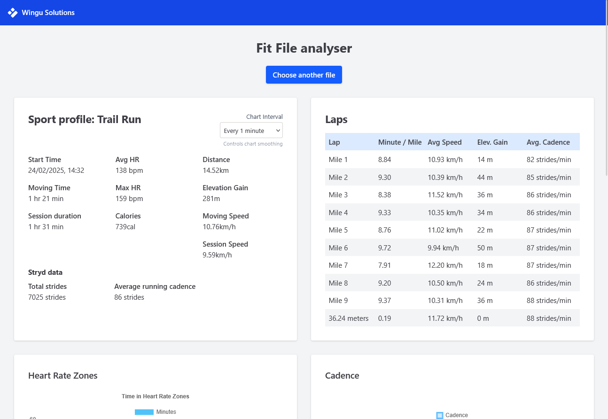
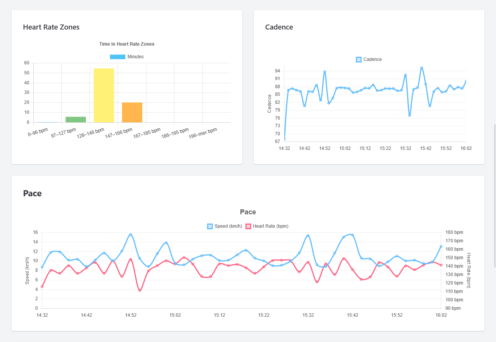

# FIT Run Dashboard 🏃‍♂️📈
Download a local Desktop app version here, works offline.

[](https://github.com/dp-perry/fit-file-visualizer/releases/latest)

Or visit: [Fit File Analyzer](https://fit.wingusol.com/) to use the analyzer. **Does not store your .fit files** 

This open-source web app visualizes `.fit` files generated by Garmin smartwatches during running activities. It allows you to view detailed statistics, downsampled charts, and heart rate zones — just drag and drop a `.fit` file to get started.

> **_Note_**: This app only supports **.fit** files and has only been tested with running activity files recorded on smartwatches (e.g. Garmin, Coros, Suunto).
---

## 🚀 Features

- Upload and parse `.fit` files (tested with running activity files only)
- Dynamic charts:
  - Pace & Heart Rate
  - Elevation
  - Cadence
  - Heart Rate Zones
- Downsampling logic reduces number of datapoints
- Choose to view data by 10s, 30s, 60s or 5m intervals
- Zoom & pan support on charts
- Lap table and session data overview

---




---

## 🛠 Tech Stack

- **React + Vite**
- **TailwindCSS** for layout & styling
- **Chart.js + react-chartjs-2** for visualizations
- **Luxon** for time formatting
- **@garmin/fit-parser** to decode `.fit` files
- **Electron** to create a desktop app
---

## 📂 Getting Started

```bash
# Clone the repo
git clone https://github.com/your-username/fit-run-dashboard.git
cd fit-run-dashboard

# Install dependencies
npm install

# Start development server
npm run dev
```

Then open http://localhost:5173 in your browser and upload a .fit file.

---

## 💻 Electron / Desktop app
[](https://github.com/yourusername/fit-run-dashboard/releases/latest)
```bash
# Create a preview
npm run electron

# Create desktop apps, make sure to run this as administrator
npm run dist

# Files will be created in the ./dist folder
```

---

## 🤝 Contributing

This project is licensed under the MIT License — see the [LICENSE](./LICENSE) file for details.

### Suggested improvements:
- Add support for metric vs imperial units (currently no checks on unit returned in .fit file)
- Automatically detect and handle non-running activities (e.g. cycling, hiking)
- Add lap-based interval highlighting
- Improve color themes or add dark/light mode switching
- Export graph images or data summaries
- Enhance error handling for invalid .fit files
- Compare two activities
- i18n - Multilanguage support
- a11y - Accessibility

Feel free to open a pull request or issue if you'd like to collaborate!


## 📄 License
This project is released under the MIT License.
Feel free to use, copy, modify, and share it however you like.

## 🙌 Acknowledgments
* [FIT SDK by Garmin](https://github.com/garmin/fit-javascript-sdk)
* [Chart.js](https://www.chartjs.org/)
* [Luxon](https://moment.github.io/luxon/#/)
* [Electron](https://www.electronjs.org/)

Everyone in the open-source running data community ✨